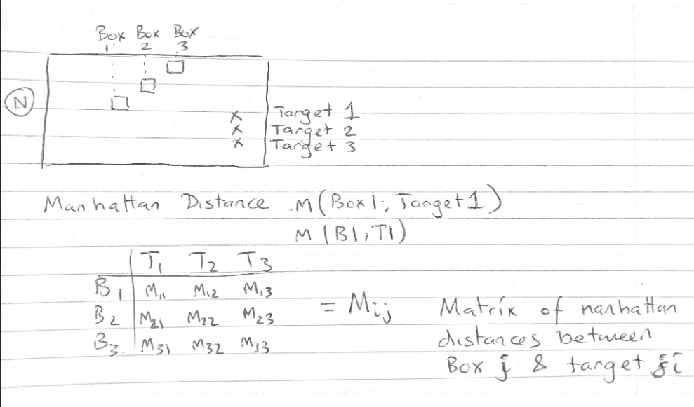
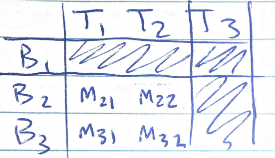
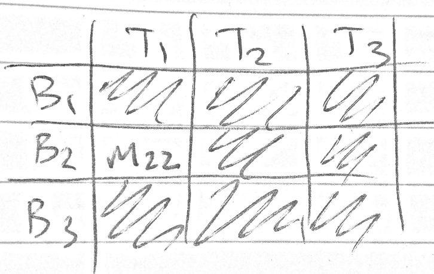
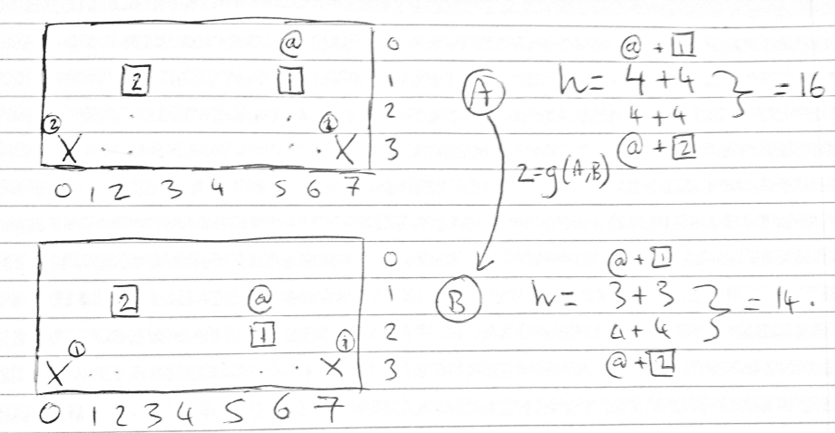
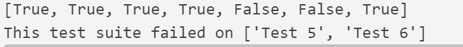
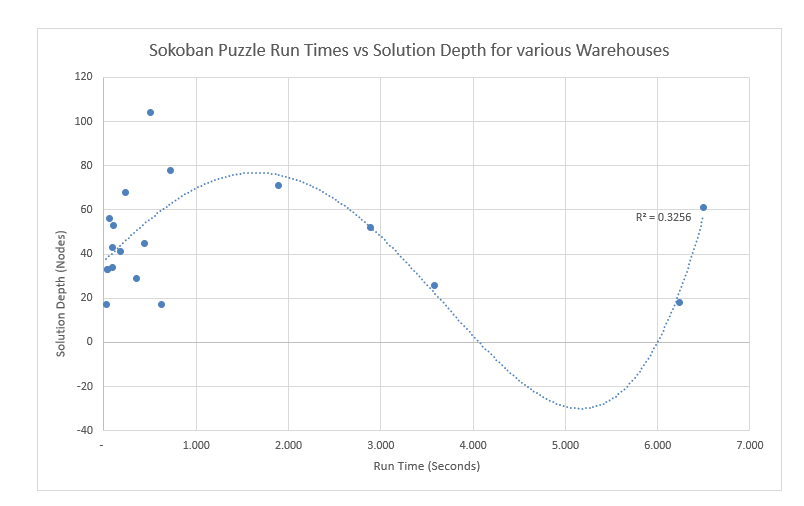

## Sokoban Puzzle and the A* Algorithm

## Section 1 - State Representations and Heuristic 

### 1.1 State Representation

I opted to represent the problem state as a tuple of tuples. Tuples were used because they are an immutable data type, making them hashable and that allowed for compatibility with the provided ```search.py```.

My tuple of tuples contains two pieces of information that can change between states.
First tuple is the worker location represented as a tuple of integers representing their column and row position.
The second tuple is a tuple of tuples with each enclosed tuple of integers representing the column and row position of a box.

For instance for ```warehouse_8a.txt``` the initial state is represented by a tuple: ```((6, 3), ((3, 2), (5, 2)))```

Everything else about a warehouse input into the class ```SokobanPuzzle``` is stored in the problem instance itself to save memory.
Due to frequent checks of neighbouring spaces a dictionary of elementary directional tuples was created along with a function ```Add_tuple()``` to facilitate quick and easy investigations of spaces adjacent to workers or boxes.

There are a number of other auxiliary functions that are mostly used to either move a game element or to check the validity of said movement.

### 1.2 Heuristics
Next in the pursuit of an effective heuristic I decided on a heuristic that closely imitates the exact cost to solve the puzzle.

I use the Manhattan distance to compute the distances between boxes and targets.
I will say that the heuristic for a particular state is the sum of Manhattan distances between box and goal for each of the boxes that can reach a goal.
This heuristic also has an advantage in being a metric that represents a solution to a simpler problem, one without walls/obstacles. This means that the heuristic will likely be consistent and admissible - more on that later.

Since we know that the maximum of a set of admissible heuristics is also admissible and we know that we can expand fewer nodes with a heuristic closer to the actual cost of reaching the goal we settle on a unique method for calculating the heuristic; we take, in order, the 1st largest Manhattan distance for a box-goal pair and then next largest for the next available box-goal pair and so on. 

To achieve this a matrix of Manhattan distances is computed. Where M_ij is the Manhattan distance between goal_i and box_j


See figure 1 below for state "N":

{ width=65% }

Once the matrix has been formed the maximum is selected and then the rows and columns corresponding to the first pair are removed.

 For instance say the max Manhattan distance comes from m13 we remove rows 1 and columns 3.The result is figure 2a. Then we say that m32 is the next largest metric we then exclude column 2 and row 3. Leaving figure 2b.

<table>
<tr>
<td>{ width=90% }</td>


<td>{ width=70% }</td>
</tr>
</table>
So it can be seen, with m22 the last largest Manhattan distance, that we get $h(N) = m_{13}+m_{32}+m_{22}$.

On the matter of consistency and admissibility I can see in figure 4 below that moving from state A to state B has an equal cost to the sum of *g(A,B)*+*h(B)* this makes it admissible and consistent in this case. 

{ width=55% }

It is easy to tell that the Manhattan distance metric will always be at most equal to the actual cost but often lesser (accounting for situations where the worker is moving but not pushing a box, the heuristic stays the same but the path cost increases).
This holds also for the sum of the Manhattan distances, since their combination represents the total cost of all paths, less the distance required of the worker to move between pushing trajectories. Guaranteeing consistency and admissibility .


## Section 2 - Test Suite
The program was tested with custom warehouses to see if the functions could successfully detect illegal moves. 
Moves that were deemed illegal included pushing a box on to another position that contained a box or wall. 
Furthermore, to prune the search tree, additional restrictions were made to the positions a box could be pushed.
These functions tested whether the new position resulted in a box that was stuck, such as a corner or along a wall.

I ran seven tests. See figure 4 for output.
I created test warehouses to ensure that ```check_elem_action_seq()``` correctly returned failure in certain situations

- Test 1 - If worker tries to move into a wall - Passed.
- Test 2 - If box tries to move into a wall - Passed.
- Test 3 - If box tries to move into another box - Passed.
- Test 4 -If box tries to move into a wall - Passed.
- Test 5 -If a box is moved onto an edge with no goals - Technically Passed, as checks prevented it from moving into aisle that would be deadlocked
- Test 6 - Push a box into a corner with no goal. - Technically Passed, as checks prevented it from moving into corner
- Test 7 - Push a box into a corner but that corner has a goal. - Passed.

{ width=60% }

## Section 3 - Performance

I ran a number of warehouses with the algorithm and compiled their run times and the solution depth. The solution was able to solve 20 warehouses in reasonable timeframes with their solution depths and run times plotted below in figure 5.

{ width=70% }

One limitation encountered was that of increasing branching factor. For problems with 4 or more boxes the program struggled to find solutions in reasonable times. This could be due to how the legality of moves is validated with lots of checking each and every box against each and every target - perhaps some unnecessary looping is involved in reducing the performance for more complex scenarios.

Additionally any problems that involve lots of narrow corridors or pushing boxes along warehouse edges also invoke more checks to avoid getting stuck along an edge or in a corner.
